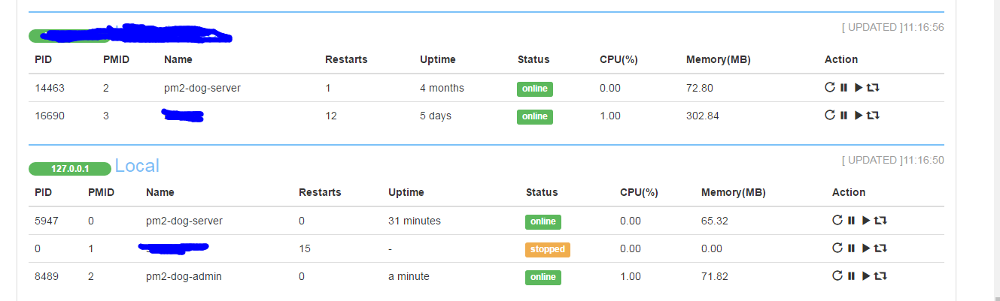

# pm2-dog-admin

Monit pm2 local and remote processes on web

* monite cpu,memory usage
* execute start,restart,reload,stop actions on web page 
* catch pm2 events and handle these evens(such as catch crash event and then sending email)

Monit services started by [pm2](https://github.com/Unitech/pm2) from local or remote host

## Usage 

admin: [pm2-dog-admin](https://github.com/Dongss/pm2-dog-admin)

server: [pm2-dog-server](https://github.com/Dongss/pm2-dog-server)

### Install server side on your pm2 processes hosts

Local or remote host:

```
git clone https://github.com/Dongss/pm2-dog-server
cd pm2-dog-server
npm install
node index.js
```

see this:

```
$node index.js 
PM2 connect success
PM2 server listening on port:  10105
```

### Install admin side on your pm2 admin host

Admin host

```
git clone https://github.com/Dongss/pm2-dog-admin
cd pm2-dog-admin
npm install
node index.js --config config.json
```

see this:

```
$node index.js --config config.json
PM2-dog admin listening on:  0.0.0.0 10106
```

if your admin listen on 0.0.0.0, change `public/javascripts/index.js` first line `ADMIN_SERVER` to your host

[config.json expample](https://github.com/Dongss/pm2-dog-admin/blob/master/default_config.json)

```
{
    "admin": {
        "host": "0.0.0.0",
        "port": 10106
    },
    "servers": [{
        "alias": "Local",
        "host": "1.1.1.1",
        "port": 10105,
        "categories": [{
            "pm_name": "pm_name",
            "category": "c_1"
        }, {
            "pm_name": "pm_name_2",
            "category": "c_2"
        }]
    }, {
        "alias": "TestHost",
        "host": "2.2.2.2",
        "port": 10105,
        "categories": [{
            "pm_name": "pm_name_23",
            "category": "c_3"
        }]
    }]
}
```

### How to dandle pm2 events

Create your `event_handler.js` file at `pm2-dog-admin/`  

An example: [event_handler.js](https://github.com/Dongss/pm2-dog-admin/blob/master/default_event_handler.js)

pm2 events:

* restart
* online
* exit
* restart overlimit

### Monite on web

Visit url localhost:10106

